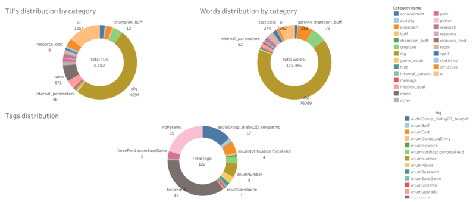
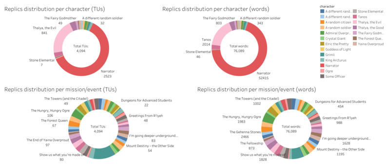

# Game Localization Data Analysis

## Overview
This project is a **data analysis case study** based on the localization file of the video game **Dungeons 3**.  
The main objective was to explore, structure, and visualize the contents of a large localization dataset in order to support the fan-driven Ukrainian localization project.  

The analysis demonstrates how **data-driven approaches** can improve the efficiency of software localization workflows, especially when dealing with large volumes of text and multiple collaborators.  

👉 The final localization result can be found on Steam: [Ukrainian Localization for Dungeons 3](https://steamcommunity.com/sharedfiles/filedetails/?id=3522560800)

---

## Project Background
The idea for this analysis emerged during a real localization project.  
The game’s localization was stored in a single file containing:
- **8182 Translation Units (TUs)** — indivisible text segments (words, phrases, sentences, or sets of sentences).
- **115985 words** across all translation units.  

Since all in-game text was contained in a single file, which made translation management challenging. To make the process more structured, the text was:
- **Classified and split into 24 thematic files** (system messages, UI elements, dialogues, storylines, etc.).
- **Analyzed by size** — both in terms of translation units and word counts.
- **Analyzed by tags** — counted and quantified each tag applied to translation units, providing insights into their distribution and usage.
- **Mapped to characters** — calculating the number of dialogue lines per character, as well as per mission.  

This provided not only a more efficient workflow for translators but also valuable insights for potential **voice-over planning** and team workload distribution.

---

## Results
The analysis led to:
- **24 text categories** with clear thematic boundaries.  
- **Detailed word & TU statistics** for each category.
- **Tag distribution analysis** — counted and visualized the frequency of each tag across translation units.  
- **Character dialogue distribution** per mission.  
- **Data visualizations** created in Tableau for quick insights.  

📊 Project's visualizations:  
Categories and tag distributions 

  

Voice over and missions distribution

 

Character involvement across Missions/Events (translation units heatmap)

.png) 

Character involvement across Missions/Events (words heatmap)

.png)   

📑 Tableau dashboards are available in [`/dashboards`](./dashboards) and on [Tableau Public](https://public.tableau.com/app/profile/dmytro.osypchuk/viz/Dungeons3LocalizationAnalysis/Categoriestagsdistribution).  

---

## Repository Structure
* `/data` → Cleaned dataset (Dungeons3_Text_Clean.csv) & calculations (Dungeons3_Localization_Analysis.xlsx).  
* `/data_raw` → Original raw localization file extracted from the game.  
* `/docs` → Project documentation (data dictionary, glossary, workflow).  
* `/images` → Tableau visualizations (charts, plots).  
* `/dashboards` → Tableau dashboard files.  

---

## Tools & Technologies
- **Google Sheets** – for cleaning, classification, and notes.  
- **Tableau** – for visualization and exploration of key insights.  

*(Detailed workflow with Google Sheets will be described in [`/docs/workflow.md`].)*

---

## Usage
To explore the analysis:
1. Open `/data` for cleaned datasets in `.csv` and `.xlsx` formats.  
2. View visualizations in `/images` or open Tableau dashboards from `/dashboards`.  

---

## Skills Demonstrated
- Data Cleaning & Structuring  
- Exploratory Data Analysis (EDA)  
- Data Visualization & Dashboarding  
- Project Documentation  
- Domain-Specific Analysis (Game Localization)  

---

## Key Takeaways
This project illustrates how **data analysis can enhance the localization process** by:
- Transforming unstructured game files into meaningful datasets.  
- Enabling team-based workflows through structured text segmentation.  
- Providing statistical and visual insights for translation and dubbing tasks.  

It can serve both as:
- A **portfolio project** showcasing practical data analysis skills.  
- A **real-world case study** of applying data analytics in **software localization**.  

---

## Author
Created as part of a fan localization project for **Dungeons 3**, with the goal of improving translation workflows through data analysis and visualization by **Dmytro Osypchuk**.
